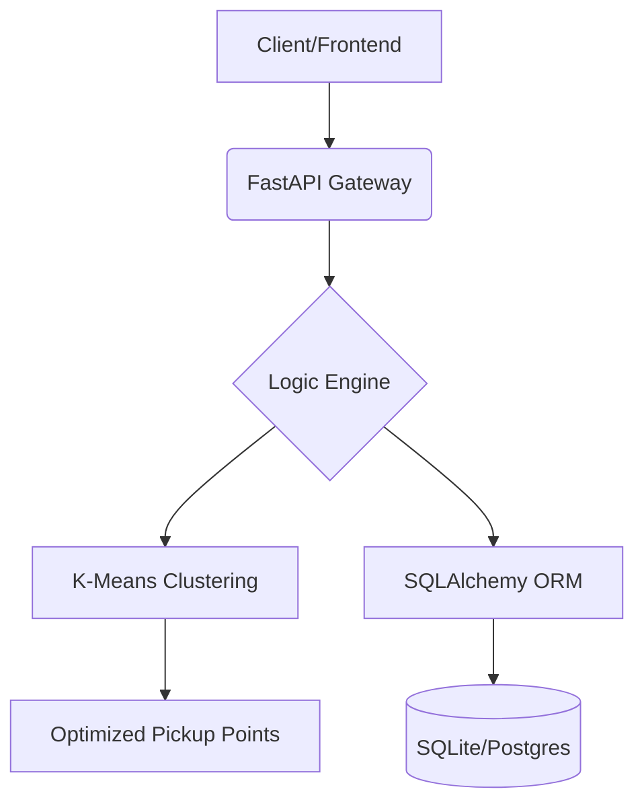

# 🎓 Student Grouping Microservice
> **regroupement-eleve-api** — A smart geographic clustering engine for student logistics.

[](https://fastapi.tiangolo.com/)
[](https://www.docker.com/)
[](https://www.python.org/)
[](https://scikit-learn.org/)

---

## 📝 Description
This microservice automates the grouping of students based on their geographic location. By leveraging **K-Means clustering**, it calculates the most efficient pickup points to minimize travel distance and optimize transport logistics.

## ✨ Key Features
- 📍 **Smart Clustering:** Group students based on real-world coordinates.
- 🤖 **ML-Powered:** Optimal pickup point calculation using Scikit-Learn.
- ⚡ **High Performance:** Built with FastAPI for asynchronous efficiency.
- 🐳 **Cloud Ready:** Fully containerized with Docker & Docker Compose.
- 🛠️ **Configurable:** Fine-tune group sizes and environment variables on the fly.
- 📖 **Self-Documenting:** Interactive API docs via Swagger and ReDoc.

---

## 🚀 Quick Start

### Using Docker (Recommended)
```bash
# Clone and launch in one command
docker-compose up -d
```
The service will be live at: `http://localhost:8000`

### Local Development
1. **Install dependencies:**
   ```bash
   pip install -r requirements.txt
   ```
2. **Launch server:**
   ```bash
   uvicorn main:app --reload
   ```

---

## 🛣️ API Roadmap

### 🔍 Discovery & Health
| Method | Endpoint | Description |
| :--- | :--- | :--- |
| `GET` | `/health` | Check service vitality |
| `GET` | `/ready` | Check if DB/Engine is ready |
| `GET` | `/docs` | **Interactive Swagger UI** |

### 👥 Group Management
| Method | Endpoint | Description |
| :--- | :--- | :--- |
| `POST` | `/groups/generate` | Trigger K-Means grouping |
| `GET` | `/groups` | List all calculated groups |
| `GET` | `/groups/{id}` | Details for a specific group |
| `GET` | `/groups/pickup-points` | Get optimized coordinates |

### ⚙️ Configuration
| Method | Endpoint | Description |
| :--- | :--- | :--- |
| `GET` | `/config` | View current runtime settings |
| `PUT` | `/config` | Update group size or debug mode |

---

## ⚙️ Environment Configuration

Create a `.env` file to customize your instance:

| Variable | Default | Description |
| :--- | :--- | :--- |
| `DATABASE_URL` | `sqlite:///...` | Connection string |
| `GROUP_SIZE` | `5` | Targeted students per group |
| `DEBUG` | `False` | Detailed error logs |
| `LOG_LEVEL` | `INFO` | Output verbosity |

---

## 🏗️ Architecture



---

## 🛠️ Built With

*   **FastAPI** - The web framework
*   **SQLAlchemy** - Database ORM
*   **Scikit-Learn** - Machine learning logic
*   **Pydantic** - Data validation
*   **Uvicorn** - ASGI server

---

## 🧪 Testing with Streamlit
Want a visual interface?
1. Start the API first.
2. Run the dashboard:
   ```bash
   streamlit run app_streamlit.py
   ```

---
📅 **Version:** 1.0.0 | 🔒 **License:** None
